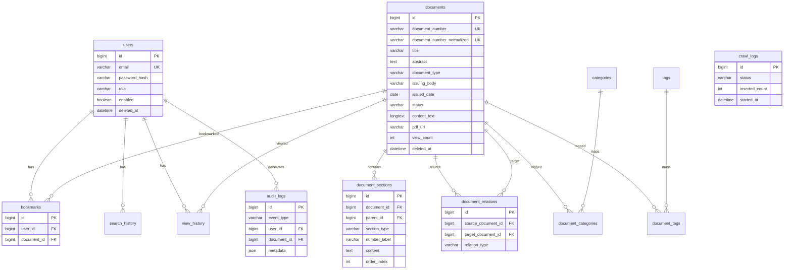

# DATABASE — Construction Legal Lookup

> Tài liệu thiết kế cơ sở dữ liệu cho hệ thống tra cứu văn bản pháp luật ngành xây dựng.  
> **DBMS:** MySQL 8.x · **ORM:** Spring Data JPA · **Migration:** Flyway  
> **Phiên bản tài liệu:** 1.0 · **Cập nhật:** 2026-07-03

---

## Mục lục

1. [Tổng quan](#1-tổng-quan)
2. [Nguyên tắc thiết kế](#2-nguyên-tắc-thiết-kế)
3. [Quy ước đặt tên](#3-quy-ước-đặt-tên)
4. [Sơ đồ quan hệ (ERD)](#4-sơ-đồ-quan-hệ-erd)
5. [Enum & hằng số nghiệp vụ](#5-enum--hằng-số-nghiệp-vụ)
6. [Chi tiết bảng](#6-chi-tiết-bảng)
7. [Chỉ mục & Full-Text Search](#7-chỉ-mục--full-text-search)
8. [Redis (bổ trợ Auth — không nằm trong MySQL)](#8-redis-bổ-trợ-auth--không-nằm-trong-mysql)
9. [Ràng buộc toàn vẹn & nghiệp vụ](#9-ràng-buộc-toàn-vẹn--nghiệp-vụ)
10. [Chiến lược dữ liệu & Crawler](#10-chiến-lược-dữ-liệu--crawler)
11. [Migration Flyway](#11-migration-flyway)
12. [Seed & dữ liệu demo](#12-seed--dữ-liệu-demo)
13. [Truy vấn mẫu](#13-truy-vấn-mẫu)
14. [Ước lượng dung lượng](#14-ước-lượng-dung-lượng)
15. [Checklist triển khai](#15-checklist-triển-khai)

---

## 1. Tổng quan

### 1.1. Phạm vi

MySQL là **single source of truth** cho toàn bộ dữ liệu nghiệp vụ:

- Văn bản pháp luật (metadata, nội dung, PDF)
- Cấu trúc điều/khoản
- Quan hệ giữa các văn bản
- Người dùng, bookmark, lịch sử
- Nhật ký hành vi (search, view, download, AI)
- Nhật ký đồng bộ crawler (optional)

**Redis (Upstash)** dùng riêng cho Refresh Token và rate limit AI — **không** lưu dữ liệu nghiệp vụ chính. Xem [mục 8](#8-redis-bổ-trợ-auth--không-nằm-trong-mysql).

### 1.2. Quy mô mục tiêu

| Thực thể | Số lượng ước tính (MVP) |
|----------|-------------------------|
| `documents` | 80 – 150 |
| `document_sections` | 2.000 – 8.000 |
| `document_relations` | 100 – 300 |
| `users` | 10 – 500 (demo + thật) |
| `audit_logs` | Tăng theo usage |

Dataset **snapshot tĩnh** — crawler chạy one-shot trước deploy; production không phụ thuộc scheduler.

### 1.3. Charset & Collation

```sql
CREATE DATABASE construction_legal_lookup
  CHARACTER SET utf8mb4
  COLLATE utf8mb4_unicode_ci;
```

- Hỗ trợ tiếng Việt có dấu đầy đủ
- Emoji trong tên user (nếu có) không lỗi encoding

---

## 2. Nguyên tắc thiết kế

| Nguyên tắc | Áp dụng |
|------------|---------|
| **Normalized core** | Metadata văn bản tách bảng; quan hệ many-to-many qua bảng trung gian |
| **Denormalize có kiểm soát** | `search_text` (không dấu) phục vụ search tiếng Việt |
| **Soft delete** | `documents`, `users` dùng `deleted_at` — admin có thể khôi phục |
| **Audit timestamp** | Mọi bảng chính có `created_at`, `updated_at` (JPA Auditing) |
| **UUID vs BIGINT** | PK dùng `BIGINT AUTO_INCREMENT` — đủ cho portfolio, join nhanh |
| **Unique số hiệu** | `document_number_normalized` — chống trùng khi crawl |
| **Guest access** | Search/view không bắt buộc user; `user_id` nullable ở audit |

---

## 3. Quy tắc đặt tên

| Loại | Quy ước | Ví dụ |
|------|---------|-------|
| Bảng | `snake_case`, số nhiều | `documents`, `document_sections` |
| Cột | `snake_case` | `issued_date`, `view_count` |
| PK | `id` | `BIGINT` |
| FK | `{entity}_id` | `document_id`, `user_id` |
| Index | `idx_{table}_{columns}` | `idx_documents_issued_date` |
| Unique | `uk_{table}_{columns}` | `uk_documents_number_normalized` |
| Enum DB | `VARCHAR` + CHECK hoặc Java enum | `document_type`, `relation_type` |

---

## 4. Sơ đồ quan hệ (ERD)



### 4.1. Mô tả quan hệ

```
users ──< bookmarks >── documents
users ──< search_history
users ──< view_history >── documents
users ──< audit_logs >── documents (optional FK)

documents ──< document_sections (self-ref parent_id)
documents ──< document_relations >── documents (source ↔ target)

categories ──< document_categories >── documents
tags ──< document_tags >── documents
```

---

## 5. Enum & hằng số nghiệp vụ

### 5.1. `document_type` — Loại văn bản

| Giá trị | Mô tả |
|---------|--------|
| `LUAT` | Luật |
| `NGHI_DINH` | Nghị định |
| `THONG_TU` | Thông tư |
| `QUYET_DINH` | Quyết định |
| `QCVN` | Quy chuẩn Việt Nam |
| `TCVN` | Tiêu chuẩn Việt Nam |
| `CONG_VAN` | Công văn |
| `KHAC` | Khác |

### 5.2. `document_status` — Trạng thái hiệu lực

| Giá trị | Mô tả |
|---------|--------|
| `CON_HIEU_LUC` | Đang hiệu lực |
| `HET_HIEU_LUC` | Hết hiệu lực |
| `CHUA_CO_HIEU_LUC` | Chưa có hiệu lực |
| `HET_HIEU_LUC_MOT_PHAN` | Hết hiệu lực một phần (optional) |

### 5.3. `section_type` — Cấu trúc văn bản

| Giá trị | Mô tả |
|---------|--------|
| `PHAN` | Phần |
| `CHUONG` | Chương |
| `MUC` | Mục |
| `DIEU` | Điều |
| `KHOAN` | Khoản |
| `DIEM` | Điểm |

### 5.4. `relation_type` — Quan hệ văn bản

| Giá trị | Hiển thị UI | Hướng |
|---------|-------------|-------|
| `GUIDED_BY` | Được hướng dẫn bởi | source ← target hướng dẫn source |
| `GUIDES` | Hướng dẫn cho | source hướng dẫn target |
| `AMENDED_BY` | Sửa đổi bởi | target sửa source |
| `AMENDS` | Bị sửa đổi / Sửa đổi | source sửa target |
| `REPLACES` | Thay thế | source thay target |
| `REPLACED_BY` | Bị thay thế | target thay source |
| `RELATED` | Liên quan | quan hệ chung |

> **Quy ước lưu:** `(source_document_id, relation_type, target_document_id)` — API layer map sang nhãn UI hai chiều.

### 5.5. `user_role`

| Giá trị | Quyền |
|---------|-------|
| `USER` | Tra cứu, bookmark, AI, lịch sử |
| `ADMIN` | Toàn quyền + CRUD + quản lý user |

### 5.6. `audit_event_type`

| Giá trị | Mô tả |
|---------|--------|
| `SEARCH` | Tìm kiếm |
| `VIEW` | Xem chi tiết văn bản |
| `DOWNLOAD` | Tải PDF |
| `AI_SUMMARIZE` | AI tóm tắt |
| `AI_ASK` | AI hỏi đáp |
| `AI_EXPLAIN` | AI giải thích đoạn chọn |

### 5.7. `crawl_status`

| Giá trị | Mô tả |
|---------|--------|
| `RUNNING` | Đang chạy |
| `SUCCESS` | Thành công |
| `PARTIAL` | Một phần lỗi |
| `FAILED` | Thất bại |

---

## 6. Chi tiết bảng

### 6.1. `users`

Tài khoản người dùng và admin.

| Cột | Kiểu | Null | Mặc định | Mô tả |
|-----|------|------|----------|-------|
| `id` | BIGINT | NO | AUTO | PK |
| `email` | VARCHAR(255) | NO | — | Unique, login |
| `password_hash` | VARCHAR(255) | NO | — | BCrypt |
| `full_name` | VARCHAR(150) | YES | NULL | Họ tên |
| `role` | VARCHAR(20) | NO | `USER` | `USER` / `ADMIN` |
| `enabled` | TINYINT(1) | NO | 1 | 0 = bị khóa |
| `created_at` | DATETIME(6) | NO | CURRENT_TIMESTAMP | |
| `updated_at` | DATETIME(6) | NO | ON UPDATE | |
| `deleted_at` | DATETIME(6) | YES | NULL | Soft delete |

**Indexes:**
- `uk_users_email` UNIQUE (`email`)
- `idx_users_role` (`role`)
- `idx_users_enabled` (`enabled`)

**Ghi chú:**
- Refresh token **không** lưu MySQL — lưu Redis (mục 8)
- Admin khóa user → `enabled = 0` + xóa refresh token Redis

---

### 6.2. `documents`

Bảng trung tâm — mỗi row = một văn bản pháp luật.

| Cột | Kiểu | Null | Mặc định | Mô tả |
|-----|------|------|----------|-------|
| `id` | BIGINT | NO | AUTO | PK |
| `document_number` | VARCHAR(100) | NO | — | Số hiệu gốc, VD: `15/2022/NĐ-CP` |
| `document_number_normalized` | VARCHAR(100) | NO | — | Chuẩn hóa dedupe |
| `title` | VARCHAR(500) | NO | — | Tên văn bản |
| `abstract` | TEXT | YES | NULL | Trích yếu |
| `document_type` | VARCHAR(30) | NO | — | Enum mục 5.1 |
| `issuing_body` | VARCHAR(255) | YES | NULL | Cơ quan ban hành |
| `signer` | VARCHAR(255) | YES | NULL | Người ký (optional) |
| `issued_date` | DATE | YES | NULL | Ngày ban hành |
| `effective_date` | DATE | YES | NULL | Ngày có hiệu lực |
| `expiry_date` | DATE | YES | NULL | Ngày hết hiệu lực |
| `status` | VARCHAR(30) | NO | `CON_HIEU_LUC` | Enum mục 5.2 |
| `field` | VARCHAR(100) | YES | `XAY_DUNG` | Lĩnh vực (mở rộng sau) |
| `pdf_url` | VARCHAR(500) | YES | NULL | URL Cloudinary hoặc path |
| `pdf_file_name` | VARCHAR(255) | YES | NULL | Tên file gốc |
| `pdf_size_bytes` | BIGINT | YES | NULL | Kích thước file |
| `content_text` | LONGTEXT | YES | NULL | Toàn văn plain text (search + AI) |
| `search_text` | LONGTEXT | YES | NULL | Text không dấu, lowercase |
| `source_url` | VARCHAR(500) | YES | NULL | URL nguồn crawl |
| `view_count` | INT | NO | 0 | Lượt xem (denormalized) |
| `download_count` | INT | NO | 0 | Lượt tải |
| `created_at` | DATETIME(6) | NO | CURRENT_TIMESTAMP | |
| `updated_at` | DATETIME(6) | NO | ON UPDATE | |
| `deleted_at` | DATETIME(6) | YES | NULL | Soft delete |

**Indexes:**
- `uk_documents_number_normalized` UNIQUE (`document_number_normalized`)
- `idx_documents_type` (`document_type`)
- `idx_documents_status` (`status`)
- `idx_documents_issuing_body` (`issuing_body`)
- `idx_documents_issued_date` (`issued_date`)
- `idx_documents_view_count` (`view_count` DESC)
- `idx_documents_updated_at` (`updated_at` DESC)
- FULLTEXT `ft_documents_search` (`title`, `abstract`, `content_text`)

**Chuẩn hóa số hiệu (`document_number_normalized`):**

```
Input:  "01/2020/NĐ-CP" | "1/2020/NĐ-CP" | "01/2020/ND-CP"
Output: "1/2020/ND-CP"   (bỏ leading zero, bỏ dấu, uppercase)
```

Logic implement ở crawler + backend khi admin tạo mới.

---

### 6.3. `document_sections`

Cấu trúc phân cấp điều, khoản — phục vụ UI mục lục và AI trích dẫn.

| Cột | Kiểu | Null | Mặc định | Mô tả |
|-----|------|------|----------|-------|
| `id` | BIGINT | NO | AUTO | PK |
| `document_id` | BIGINT | NO | — | FK → documents |
| `parent_id` | BIGINT | YES | NULL | FK self — cây phân cấp |
| `section_type` | VARCHAR(20) | NO | — | Enum mục 5.3 |
| `number_label` | VARCHAR(50) | YES | NULL | VD: `Điều 56`, `Khoản 2` |
| `title` | VARCHAR(500) | YES | NULL | Tiêu đề section |
| `content` | TEXT | YES | NULL | Nội dung section |
| `order_index` | INT | NO | 0 | Thứ tự trong văn bản |
| `anchor_slug` | VARCHAR(100) | YES | NULL | VD: `dieu-56-khoan-2` — deep link |
| `created_at` | DATETIME(6) | NO | CURRENT_TIMESTAMP | |
| `updated_at` | DATETIME(6) | NO | ON UPDATE | |

**Indexes:**
- `idx_sections_document_id` (`document_id`)
- `idx_sections_parent_id` (`parent_id`)
- `idx_sections_document_order` (`document_id`, `order_index`)
- `idx_sections_number_label` (`document_id`, `number_label`)

**Ghi chú:** Không bắt buộc mọi văn bản đều parse được sections. MVP: parse sạch ~10–20 văn bản quan trọng; còn lại chỉ `content_text`.

---

### 6.4. `document_relations`

Quan hệ giữa hai văn bản.

| Cột | Kiểu | Null | Mặc định | Mô tả |
|-----|------|------|----------|-------|
| `id` | BIGINT | NO | AUTO | PK |
| `source_document_id` | BIGINT | NO | — | FK → documents |
| `target_document_id` | BIGINT | NO | — | FK → documents |
| `relation_type` | VARCHAR(30) | NO | — | Enum mục 5.4 |
| `note` | VARCHAR(500) | YES | NULL | Ghi chú (optional) |
| `created_at` | DATETIME(6) | NO | CURRENT_TIMESTAMP | |

**Indexes:**
- `uk_relations_unique` UNIQUE (`source_document_id`, `target_document_id`, `relation_type`)
- `idx_relations_source` (`source_document_id`, `relation_type`)
- `idx_relations_target` (`target_document_id`, `relation_type`)

**Ràng buộc:**
- `source_document_id <> target_document_id`
- ON DELETE CASCADE khi xóa hard document (soft delete thì giữ relation)

---

### 6.5. `categories`

Danh mục phân loại (theo lĩnh vực, chủ đề).

| Cột | Kiểu | Null | Mặc định | Mô tả |
|-----|------|------|----------|-------|
| `id` | BIGINT | NO | AUTO | PK |
| `name` | VARCHAR(150) | NO | — | Tên danh mục |
| `slug` | VARCHAR(150) | NO | — | URL-friendly |
| `description` | TEXT | YES | NULL | |
| `display_order` | INT | NO | 0 | Thứ tự hiển thị |
| `created_at` | DATETIME(6) | NO | CURRENT_TIMESTAMP | |
| `updated_at` | DATETIME(6) | NO | ON UPDATE | |

**Indexes:**
- `uk_categories_slug` UNIQUE (`slug`)

**Seed mẫu:** Giấy phép xây dựng, PCCC, An toàn lao động, Quy hoạch, Nghiệm thu, Hợp đồng xây dựng...

---

### 6.6. `document_categories`

Many-to-many: documents ↔ categories.

| Cột | Kiểu | Null | Mô tả |
|-----|------|------|-------|
| `document_id` | BIGINT | NO | FK → documents |
| `category_id` | BIGINT | NO | FK → categories |

**PK:** (`document_id`, `category_id`)

---

### 6.7. `tags`

Tag tự do — admin gán thêm nhãn.

| Cột | Kiểu | Null | Mô tả |
|-----|------|------|-------|
| `id` | BIGINT | NO | PK |
| `name` | VARCHAR(100) | NO | Tên tag |
| `slug` | VARCHAR(100) | NO | Unique |
| `created_at` | DATETIME(6) | NO | |

**Indexes:** `uk_tags_slug` UNIQUE (`slug`)

---

### 6.8. `document_tags`

Many-to-many: documents ↔ tags.

| Cột | Kiểu | Null | Mô tả |
|-----|------|------|-------|
| `document_id` | BIGINT | NO | FK |
| `tag_id` | BIGINT | NO | FK |

**PK:** (`document_id`, `tag_id`)

---

### 6.9. `bookmarks`

Văn bản yêu thích của user.

| Cột | Kiểu | Null | Mô tả |
|-----|------|------|-------|
| `id` | BIGINT | NO | PK |
| `user_id` | BIGINT | NO | FK → users |
| `document_id` | BIGINT | NO | FK → documents |
| `created_at` | DATETIME(6) | NO | Thời điểm bookmark |

**Indexes:**
- `uk_bookmarks_user_document` UNIQUE (`user_id`, `document_id`)
- `idx_bookmarks_user_created` (`user_id`, `created_at` DESC)

---

### 6.10. `search_history`

Lịch sử tìm kiếm (user đã đăng nhập).

| Cột | Kiểu | Null | Mô tả |
|-----|------|------|-------|
| `id` | BIGINT | NO | PK |
| `user_id` | BIGINT | NO | FK → users |
| `query` | VARCHAR(500) | YES | Từ khóa |
| `filters_json` | JSON | YES | Bộ lọc đã áp dụng |
| `result_count` | INT | YES | Số kết quả |
| `created_at` | DATETIME(6) | NO | |

**Indexes:**
- `idx_search_history_user_created` (`user_id`, `created_at` DESC)

**Giới hạn UI:** hiển thị 20 mục gần nhất; có thể purge cron hoặc `DELETE` khi > 100/user.

---

### 6.11. `view_history`

Lịch sử xem văn bản.

| Cột | Kiểu | Null | Mô tả |
|-----|------|------|-------|
| `id` | BIGINT | NO | PK |
| `user_id` | BIGINT | NO | FK → users |
| `document_id` | BIGINT | NO | FK → documents |
| `created_at` | DATETIME(6) | NO | |

**Indexes:**
- `idx_view_history_user_created` (`user_id`, `created_at` DESC)
- `idx_view_history_document` (`document_id`)

**Ghi chú:** Mỗi lần xem ghi row mới (hoặc upsert 1 row/document — tùy UX; khuyến nghị **ghi mới** để có timeline).

---

### 6.12. `audit_logs`

Nhật ký hành vi — phục vụ admin dashboard và thống kê.

| Cột | Kiểu | Null | Mô tả |
|-----|------|------|-------|
| `id` | BIGINT | NO | PK |
| `event_type` | VARCHAR(30) | NO | Enum mục 5.6 |
| `user_id` | BIGINT | YES | NULL nếu guest |
| `document_id` | BIGINT | YES | NULL nếu search |
| `ip_address` | VARCHAR(45) | YES | IPv4/IPv6 |
| `user_agent` | VARCHAR(500) | YES | Browser |
| `metadata_json` | JSON | YES | Chi tiết (query, AI question...) |
| `created_at` | DATETIME(6) | NO | |

**Indexes:**
- `idx_audit_event_created` (`event_type`, `created_at` DESC)
- `idx_audit_user_created` (`user_id`, `created_at` DESC)
- `idx_audit_document` (`document_id`)
- `idx_audit_created` (`created_at` DESC)

**Ví dụ `metadata_json`:**

```json
// SEARCH
{ "query": "giấy phép xây dựng", "filters": { "type": "NGHI_DINH" }, "resultCount": 12 }

// AI_ASK
{ "question": "Điều kiện cấp GPXD?", "model": "gemini-1.5-flash", "tokensUsed": 1840 }
```

---

### 6.13. `crawl_logs`

Nhật ký đồng bộ crawler (admin optional).

| Cột | Kiểu | Null | Mô tả |
|-----|------|------|-------|
| `id` | BIGINT | NO | PK |
| `status` | VARCHAR(20) | NO | Enum mục 5.7 |
| `triggered_by` | VARCHAR(50) | YES | `MANUAL`, `CRON`, `CLI` |
| `triggered_by_user_id` | BIGINT | YES | FK admin nếu trigger từ UI |
| `started_at` | DATETIME(6) | NO | |
| `finished_at` | DATETIME(6) | YES | |
| `inserted_count` | INT | NO | 0 |
| `updated_count` | INT | NO | 0 |
| `skipped_count` | INT | NO | 0 |
| `error_count` | INT | NO | 0 |
| `error_details` | JSON | YES | Danh sách lỗi |
| `notes` | TEXT | YES | |

**Indexes:**
- `idx_crawl_logs_started` (`started_at` DESC)

---

## 7. Chỉ mục & Full-Text Search

### 7.1. Full-Text Search (MySQL InnoDB)

```sql
ALTER TABLE documents
  ADD FULLTEXT INDEX ft_documents_search (title, abstract, content_text);
```

**Truy vấn mẫu:**

```sql
SELECT id, title, document_number,
       MATCH(title, abstract, content_text) AGAINST(:q IN BOOLEAN MODE) AS relevance
FROM documents
WHERE deleted_at IS NULL
  AND MATCH(title, abstract, content_text) AGAINST(:q IN BOOLEAN MODE)
ORDER BY relevance DESC
LIMIT 20;
```

### 7.2. Bổ trợ tiếng Việt — cột `search_text`

MySQL FTS **không tách từ tiếng Việt** tốt. Chiến lược kết hợp:

1. **FULLTEXT** trên nội dung có dấu (match từ nguyên văn)
2. **LIKE** trên `search_text` (đã bỏ dấu, lowercase) khi FTS score thấp
3. **Exact match** `document_number` / prefix khi input giống số hiệu

```sql
-- Fallback không dấu
WHERE search_text LIKE CONCAT('%', :normalizedQuery, '%')
```

**Hàm chuẩn hóa (Java):** bỏ dấu Unicode NFD → strip combining marks → lowercase.

### 7.3. Autocomplete

```sql
SELECT id, document_number, title
FROM documents
WHERE deleted_at IS NULL
  AND (
    document_number LIKE CONCAT(:prefix, '%')
    OR title LIKE CONCAT(:prefix, '%')
  )
ORDER BY
  CASE WHEN document_number LIKE CONCAT(:prefix, '%') THEN 0 ELSE 1 END,
  view_count DESC
LIMIT 8;
```

Optional cache Redis: `search:suggest:{prefix}` TTL 600s.

### 7.4. Filter kết hợp

```sql
WHERE deleted_at IS NULL
  AND (:type IS NULL OR document_type = :type)
  AND (:status IS NULL OR status = :status)
  AND (:issuingBody IS NULL OR issuing_body = :issuingBody)
  AND (:year IS NULL OR YEAR(issued_date) = :year)
  AND (:dateFrom IS NULL OR issued_date >= :dateFrom)
  AND (:dateTo IS NULL OR issued_date <= :dateTo)
```

---

## 8. Redis (bổ trợ Auth — không nằm trong MySQL)

Redis **không thay thế** bảng MySQL. Schema key:

| Key pattern | Type | TTL | Nội dung |
|-------------|------|-----|----------|
| `refresh_token:{jti}` | Hash | 7 ngày | `userId`, `email`, `userAgent`, `createdAt` |
| `user:refresh:{userId}` | Set | — | Tập `jti` đang active |
| `ai:rate:{userId}:{yyyyMMdd}` | String (counter) | 24h | Số request AI trong ngày |

**Luồng revoke khi admin khóa user:**

```
1. UPDATE users SET enabled = 0 WHERE id = ?
2. SMEMBERS user:refresh:{userId}
3. DEL refresh_token:{jti} cho từng jti
4. DEL user:refresh:{userId}
```

---

## 9. Ràng buộc toàn vẹn & nghiệp vụ

### 9.1. Foreign Keys

| Bảng con | FK | ON DELETE |
|----------|-----|-----------|
| `document_sections` | `document_id` | CASCADE |
| `document_sections` | `parent_id` | SET NULL |
| `document_relations` | `source_document_id`, `target_document_id` | CASCADE |
| `bookmarks` | `user_id`, `document_id` | CASCADE |
| `search_history` | `user_id` | CASCADE |
| `view_history` | `user_id`, `document_id` | CASCADE |
| `audit_logs` | `user_id`, `document_id` | SET NULL |
| `document_categories` | both | CASCADE |
| `document_tags` | both | CASCADE |

### 9.2. Business rules

| Rule | Implementation |
|------|----------------|
| Không trùng số hiệu | UNIQUE `document_number_normalized` |
| Soft delete document | SET `deleted_at`; API filter `WHERE deleted_at IS NULL` |
| View count | `UPDATE documents SET view_count = view_count + 1` + insert audit |
| Bookmark trùng | UNIQUE (`user_id`, `document_id`) |
| Relation vòng | Validate `source <> target` ở service layer |
| AI rate limit | Redis INCR trước khi gọi Gemini |

### 9.3. JPA Auditing

```java
@EntityListeners(AuditingEntityListener.class)
@CreatedDate private LocalDateTime createdAt;
@LastModifiedDate private LocalDateTime updatedAt;
```

---

## 10. Chiến lược dữ liệu & Crawler

### 10.1. Pipeline one-shot (trước deploy)

```
crawler/main.py
    │
    ├─► Fetch HTML/PDF từ nguồn
    ├─► Parse metadata → documents row
    ├─► Extract text → content_text, search_text
    ├─► Parse sections (best-effort) → document_sections
    ├─► Map relations (auto + relations_manual.json) → document_relations
    ├─► Dedupe by document_number_normalized
    │
    └─► Output:
          • Flyway seed SQL (V2__seed_documents.sql)
          • hoặc INSERT trực tiếp MySQL local → mysqldump
```

### 10.2. Mapping crawler → DB

| Crawler field | DB column |
|---------------|-----------|
| `so_hieu` | `document_number` + normalized |
| `ten_vb` | `title` |
| `trich_yeu` | `abstract` |
| `loai_vb` | `document_type` |
| `co_quan` | `issuing_body` |
| `ngay_ban_hanh` | `issued_date` |
| `hieu_luc` | `status`, `effective_date`, `expiry_date` |
| `pdf_path` | upload → `pdf_url` |
| `full_text` | `content_text`, `search_text` |
| `source` | `source_url` |

### 10.3. Insert vs Update (crawl lần 2+)

```sql
INSERT INTO documents (...)
VALUES (...)
ON DUPLICATE KEY UPDATE
  title = VALUES(title),
  abstract = VALUES(abstract),
  content_text = VALUES(content_text),
  search_text = VALUES(search_text),
  status = VALUES(status),
  updated_at = CURRENT_TIMESTAMP(6);
```

Ghi nhận vào `crawl_logs`: `inserted_count`, `updated_count`, `skipped_count`.

---

## 11. Migration Flyway

### 11.1. Thứ tự file

```
db/migration/
├── V1__init_schema.sql          # Tạo toàn bộ bảng, index, FK
├── V2__seed_categories.sql      # Danh mục cố định
├── V3__seed_demo_users.sql      # user@demo.com, admin@demo.com
└── V4__seed_documents.sql       # Data từ crawler (có thể file lớn)
```

> `V4` có thể tách nhiều file `V4_1`, `V4_2`... nếu seed quá lớn, hoặc import qua script riêng ngoài Flyway.

### 11.2. V1 — DDL tóm tắt

File `V1__init_schema.sql` tạo lần lượt:

1. `users`
2. `documents` (+ FULLTEXT)
3. `document_sections`
4. `document_relations`
5. `categories`, `document_categories`
6. `tags`, `document_tags`
7. `bookmarks`
8. `search_history`
9. `view_history`
10. `audit_logs`
11. `crawl_logs`

### 11.3. Rollback

Flyway không rollback tự động. Dev reset:

```bash
flyway clean   # CHỈ local
flyway migrate
```

Production: **không** dùng `clean`; chỉ `migrate` forward.

---

## 12. Seed & dữ liệu demo

### 12.1. Tài khoản demo (`V3`)

| Email | Password | Role |
|-------|----------|------|
| `user@demo.com` | `Demo@123` | USER |
| `admin@demo.com` | `Admin@123` | ADMIN |

> Hash BCrypt trong SQL seed — **đổi password trên production thật**.

### 12.2. Categories seed (`V2`)

| slug | name |
|------|------|
| `giay-phep-xay-dung` | Giấy phép xây dựng |
| `pccc` | Phòng cháy chữa cháy |
| `an-toan-lao-dong` | An toàn lao động xây dựng |
| `quy-hoach` | Quy hoạch xây dựng |
| `nghiem-thu` | Nghiệm thu công trình |
| `hop-dong-xay-dung` | Hợp đồng xây dựng |

### 12.3. Documents seed (`V4`)

- Nguồn: output crawler
- Tối thiểu **80 văn bản**, ưu tiên lĩnh vực xây dựng
- Tối thiểu **30 quan hệ** verified
- Tối thiểu **10 văn bản** có `document_sections`

---

## 13. Truy vấn mẫu

### 13.1. Trang chủ — văn bản mới ban hành

```sql
SELECT id, document_number, title, issued_date, document_type
FROM documents
WHERE deleted_at IS NULL
ORDER BY issued_date DESC
LIMIT 10;
```

### 13.2. Trang chủ — văn bản nổi bật

```sql
SELECT id, document_number, title, view_count
FROM documents
WHERE deleted_at IS NULL
ORDER BY view_count DESC
LIMIT 10;
```

### 13.3. Thống kê trang chủ

```sql
SELECT
  COUNT(*) AS total_documents,
  COUNT(DISTINCT document_type) AS total_types,
  COUNT(DISTINCT issuing_body) AS total_issuing_bodies
FROM documents
WHERE deleted_at IS NULL;
```

### 13.4. Quan hệ văn bản theo document

```sql
-- Văn bản mà doc này được hướng dẫn bởi (GUIDED_BY)
SELECT d.id, d.document_number, d.title, r.relation_type
FROM document_relations r
JOIN documents d ON d.id = r.target_document_id
WHERE r.source_document_id = :documentId
  AND r.relation_type = 'GUIDED_BY'
  AND d.deleted_at IS NULL;
```

### 13.5. Admin — top từ khóa search (7 ngày)

```sql
SELECT
  JSON_UNQUOTE(JSON_EXTRACT(metadata_json, '$.query')) AS keyword,
  COUNT(*) AS search_count
FROM audit_logs
WHERE event_type = 'SEARCH'
  AND created_at >= NOW() - INTERVAL 7 DAY
  AND metadata_json->>'$.query' IS NOT NULL
GROUP BY keyword
ORDER BY search_count DESC
LIMIT 10;
```

### 13.6. Bookmark của user

```sql
SELECT d.id, d.document_number, d.title, b.created_at
FROM bookmarks b
JOIN documents d ON d.id = b.document_id
WHERE b.user_id = :userId
  AND d.deleted_at IS NULL
ORDER BY b.created_at DESC;
```

---

## 14. Ước lượng dung lượng

| Thành phần | Ước tính |
|------------|----------|
| 150 documents × ~200KB text | ~30 MB |
| 5000 sections × ~2KB | ~10 MB |
| PDF (external Cloudinary) | Không tính vào MySQL |
| audit_logs (10k rows) | ~5 MB |
| **Tổng MySQL MVP** | **< 100 MB** |

Free tier Railway/Aiven (256MB–1GB) **đủ thoải mái**.

---

## 15. Checklist triển khai

### Schema
- [ ] `V1__init_schema.sql` chạy thành công trên MySQL 8
- [ ] FULLTEXT index hoạt động
- [ ] UNIQUE `document_number_normalized` chặn duplicate

### Data
- [ ] Crawler seed ≥ 80 văn bản
- [ ] `content_text` không rỗng với mọi văn bản
- [ ] ≥ 30 relations verified
- [ ] Demo users seed

### Backend
- [ ] JPA entities map đúng snake_case
- [ ] Soft delete filter global (`@SQLRestriction` hoặc spec)
- [ ] Pagination default `size=20`

### Production
- [ ] Flyway migrate trên Railway MySQL
- [ ] Backup dump trước khi import V4 lớn
- [ ] Redis Upstash kết nối qua `rediss://`

### Docs
- [ ] ERD diagram cập nhật khi schema đổi
- [ ] Ghi version migration trong README

---

## Phụ lục A — DDL tham khảo (`documents`)

```sql
CREATE TABLE documents (
    id                          BIGINT          NOT NULL AUTO_INCREMENT,
    document_number             VARCHAR(100)    NOT NULL,
    document_number_normalized  VARCHAR(100)    NOT NULL,
    title                       VARCHAR(500)    NOT NULL,
    abstract                    TEXT            NULL,
    document_type               VARCHAR(30)     NOT NULL,
    issuing_body                VARCHAR(255)    NULL,
    signer                      VARCHAR(255)    NULL,
    issued_date                 DATE            NULL,
    effective_date              DATE            NULL,
    expiry_date                 DATE            NULL,
    status                      VARCHAR(30)     NOT NULL DEFAULT 'CON_HIEU_LUC',
    field                       VARCHAR(100)    NULL DEFAULT 'XAY_DUNG',
    pdf_url                     VARCHAR(500)    NULL,
    pdf_file_name               VARCHAR(255)    NULL,
    pdf_size_bytes              BIGINT          NULL,
    content_text                LONGTEXT        NULL,
    search_text                 LONGTEXT        NULL,
    source_url                  VARCHAR(500)    NULL,
    view_count                  INT             NOT NULL DEFAULT 0,
    download_count              INT             NOT NULL DEFAULT 0,
    created_at                  DATETIME(6)     NOT NULL DEFAULT CURRENT_TIMESTAMP(6),
    updated_at                  DATETIME(6)     NOT NULL DEFAULT CURRENT_TIMESTAMP(6) ON UPDATE CURRENT_TIMESTAMP(6),
    deleted_at                  DATETIME(6)     NULL,
    PRIMARY KEY (id),
    UNIQUE KEY uk_documents_number_normalized (document_number_normalized),
    KEY idx_documents_type (document_type),
    KEY idx_documents_status (status),
    KEY idx_documents_issuing_body (issuing_body),
    KEY idx_documents_issued_date (issued_date),
    KEY idx_documents_view_count (view_count),
    KEY idx_documents_updated_at (updated_at),
    FULLTEXT KEY ft_documents_search (title, abstract, content_text)
) ENGINE=InnoDB DEFAULT CHARSET=utf8mb4 COLLATE=utf8mb4_unicode_ci;
```

---

## Phụ lục B — Entity map (Spring JPA)

| Bảng MySQL | Entity Java | Repository |
|------------|-------------|------------|
| `users` | `User` | `UserRepository` |
| `documents` | `Document` | `DocumentRepository` |
| `document_sections` | `DocumentSection` | `DocumentSectionRepository` |
| `document_relations` | `DocumentRelation` | `DocumentRelationRepository` |
| `categories` | `Category` | `CategoryRepository` |
| `tags` | `Tag` | `TagRepository` |
| `bookmarks` | `Bookmark` | `BookmarkRepository` |
| `search_history` | `SearchHistory` | `SearchHistoryRepository` |
| `view_history` | `ViewHistory` | `ViewHistoryRepository` |
| `audit_logs` | `AuditLog` | `AuditLogRepository` |
| `crawl_logs` | `CrawlLog` | `CrawlLogRepository` |

---

*Tài liệu này là baseline cho Flyway migrations và JPA entities. Cập nhật version khi schema thay đổi.*
